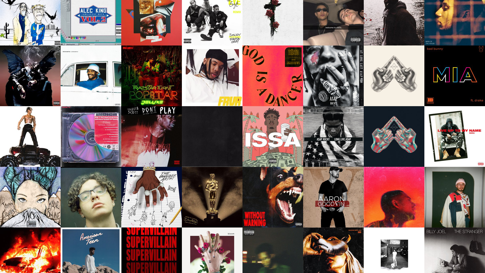

<!-- Project Header -->
<div align="center">
  

  <h1 class="projectName">Collage Generator for Last.fm</h1>

  <p class="projectBadges">
    
    
    
    <a href="LICENSE">
      
    </a>
  </p>

  <p class="projectDesc">
    A command-line app to generate a collage of your favorite albums based on Last.fm scrobbles
  </p>

  <br/>
</div>


## Installation
1. Python 3 is required. You can download it from [here](https://www.python.org/downloads/).
2. [Requests](https://pypi.org/project/requests/) and [Pillow](https://pypi.org/project/Pillow/) are required dependencies. Use `pip install requests` and `pip install Pillow` to install them.
3. A Last.fm API key is required to fetch a user's top albums. You can get one easily [here](https://www.last.fm/api/). You can either put your key in a text file called `apikey.txt` or pass it as a command line argument (not recommended)


## Usage
Run the program from the command-line like so: `python3 collage_generator_for_lastfm.py example 1920 1080`. You need to provide the user, width, and height but the other arguments are optional. All available arguments are listed below.

```
collage_generator_for_lastfm.py [-h] [--size SIZE] [--apikey APIKEY]
                                [--output OUTPUT] [--filetype {jpg,png}]
                                [--jpeg_quality {1-100}]
                                [--png_compression {0-9}]
                                [--period {forever,year,6month,3month,month,week}]
                                [--layout {spiral,topleft}]
                                [--update_images {auto,yes,no}]
                                [--ignore_warnings]
                                user width height


positional arguments:
  user                  The Last.fm user to get favorite albums of
  width                 The width of the output image (in pixels)
  height                The heights of the output image (in pixels)

optional arguments:
  -h, --help            show this help message and exit
  --size SIZE, -s SIZE  The height and width of each album cover (in pixels).
                        Default: 300
  --apikey APIKEY, -k APIKEY
                        Your API key for Last.fm. It is recommended to put
                        your API key in apikey.txt instead of passing it as an
                        argument. An API key is required for this program to
                        work
  --output OUTPUT, -o OUTPUT
                        The filename of the output image. The file extension
                        doesn't have to be included. Default: collage
  --filetype {jpg,png}, -f {jpg,png}
                        The filetype of the output image. Default: jpg
  --jpeg_quality {1-100}, -q {1-100}
                        The quality of the output image (when using JPEG).
                        Higher values look better but produce a larger file
                        size. Default: 100
  --png_compression {0-9}, -c {0-9}
                        The compression level of the output image (when using
                        PNG). Higher values take longer to process but produce
                        a smaller file size. Default: 9
  --period {forever,year,6month,3month,month,week}, -p {forever,year,6month,3month,month,week}
                        The period from which to fetch favorite albums.
                        Default: forever
  --layout {spiral,topleft}, -l {spiral,topleft}
                        The layout of albums in the output image. Spiral
                        places the top albums in the center and less popular
                        albums near the edges using a spiral pattern. Topleft
                        places images column by column, starting from the top-
                        left corner. Default: topleft
  --update_images {auto,yes,no}, -u {auto,yes,no}
                        Whether to fetch updated albums and images from the
                        server. Auto only updates the images if settings are
                        changed or if the downloaded images are over a week
                        old. Default: auto
  --ignore_warnings, -i
                        Ignore all warnings and proceed using default values
```

## Screenshots
|               &#8291;                |               &#8291;                |
| :----------------------------------: | :----------------------------------: |
|  |  |


## Contributing
Contributions, issues, and forks are welcome.


## License
This project is licensed under the Mozilla Public License 2.0. See [LICENSE](LICENSE) for details. This project is not affiliated with or endorsed by Last.fm in any way. All album covers belong to their respective owners.


## 💕 Funding

Find this project useful? [Sponsoring me](https://johng.io/funding) will help me cover costs and **_commit_** more time to open-source.

If you can't donate but still want to contribute, don't worry. There are many other ways to help out, like:

- 📢 reporting (submitting feature requests & bug reports)
- 👨‍💻 coding (implementing features & fixing bugs)
- 📝 writing (documenting & translating)
- 💬 spreading the word
- ⭐ starring the project

I appreciate the support!
